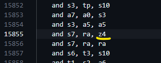
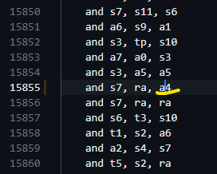
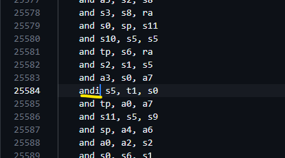
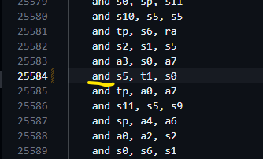

# challenge_level1/challenge1_logical

Rectification of the test.S file to successfully perform the spike test simulation.

## Bug
Enter to the directory with buggy test.S file.

```bash
cd challenge_level1/challenge1_logical
```

Try the buggy file to see any errors present by executing the make file with the command.
```bash
make
```
\
This is the error message.


## Rectification of the test.S file.

- Error message 1 -->

 >>> 

Here in the line 15855, the "z4" resigter was creating the error as the "z4" register is not a valid registered and it was not declared.\
So  I have changed it to "a4".


- Error message 2 -->

 >>> 

Here in the line 25584, the "andi" instruction was creating the error as the "andi" instruction takes the immediate value as an argument which is not in this case ( The argument passed here is "s0" register ).\
So  I have changed the instruction to "and " which successfully runs the make file.

Now we try the make file with the updated test.S file.
```bash
make
```
\
This is the final execution of the make without any bugs.\
We can see the "test.elf", "test.diass", "test_spike_signature.log" and "test_spike.dump" files are succesfully generated.


## Thank You